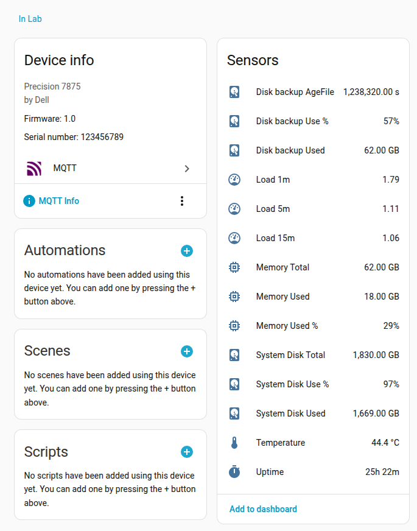

# hass-sysinfo
Home assistant sensor for Linux computers

## Home assistant device



## Run

```bash
docker run --rm \
  -e MQTT_HOST=mqtt-broker \
  -e MQTT_PORT=1883 \
  -e POLL_FREQUENCY=60 \
  -v /:/host:ro,rslave \
  klaspihl/hass-sysinfo:latest
```


## Environment variables
    environment:
      # MQTT configuration
      - MQTT_HOST=mqtt-broker
      - MQTT_PORT=1883
      #- HA_DISCOVERY_BASE=homeassistant/sensor
      
      # Device information
      - HOSTNAME=${HOSTNAME} #Use the host's hostname as the device name in Home Assistant
      #- MANUFACTURER=Lenovo
      #- MODEL=ThinkPad X1
      #- SUGGESTED_AREA=Office
      #- SERIAL=1234567890
      
      # Sensor configuration
      #- POLL_FREQUENCY=60 #Polling frequency in seconds. Default is 60 seconds.
      #- MOUNT_POINTS=/,/boot #Additional mount points to monitor for disk usage and age. Default is root (/) only.
      #- MOUNT_FILEAGE=/boot #Monitor file age on this mount point. 
      #- DEBUG=true
      #- SENSOR_EXPIRE=60 #Default value POLL_FREQUENCY * 3
      #- SENSOR_DISKAGE_EXPIRE=600 #Default value POLL_FREQUENCY * 10
